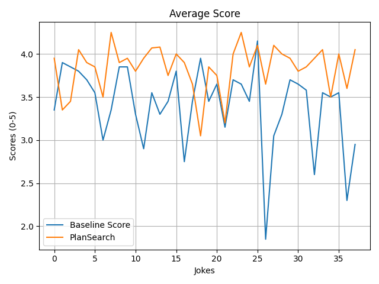
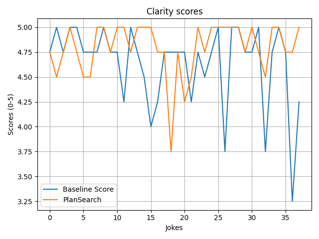
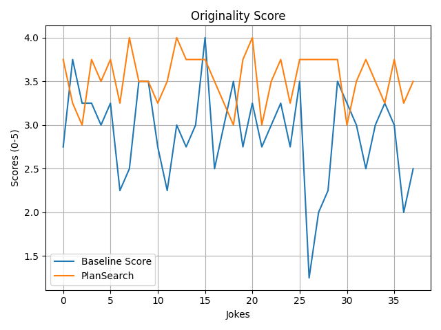
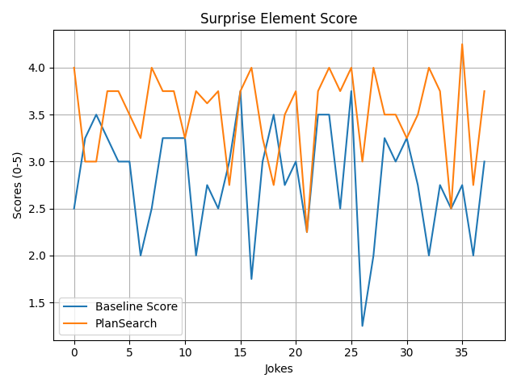
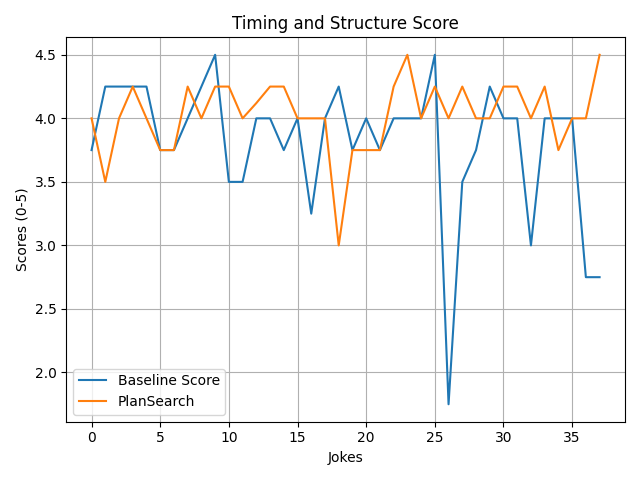

# Can LLM generate novel jokes?

## Steps to reproduce
### Product random topics for jokes
1. python prepare_dataset.py

### Producing baseline results
1. python baseline.py
2. evaluate.py

### Producing Plansearch results
1. python plansearch.py
2. evaluate.py      # Change the evaluated_response filename

 
## Observation

